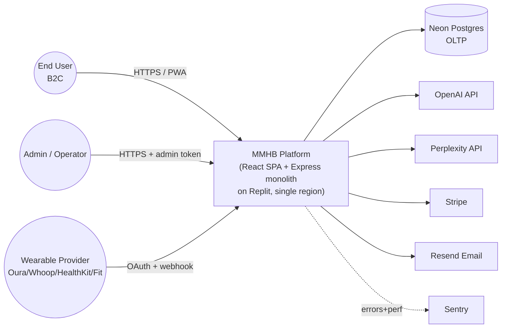
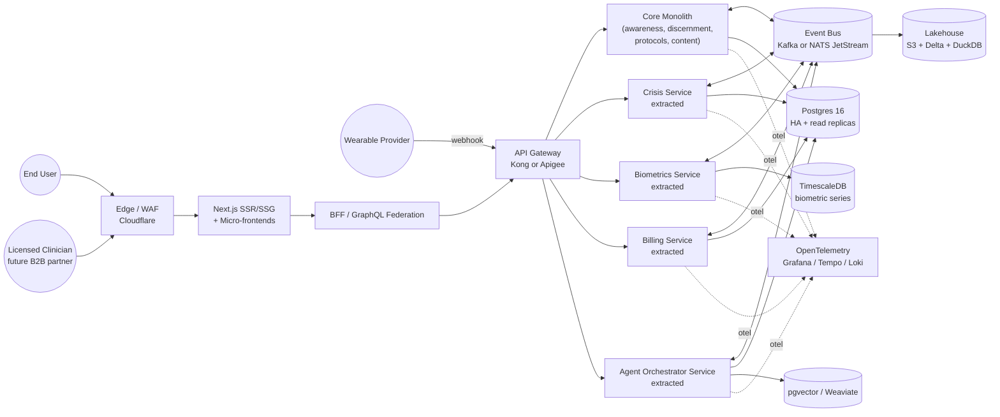
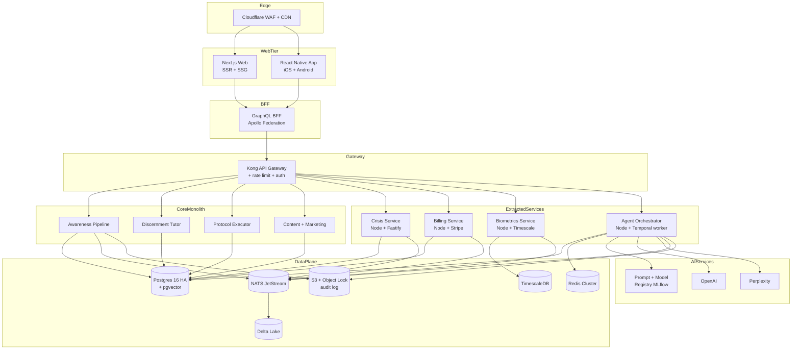
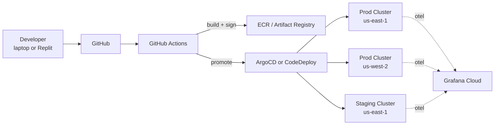
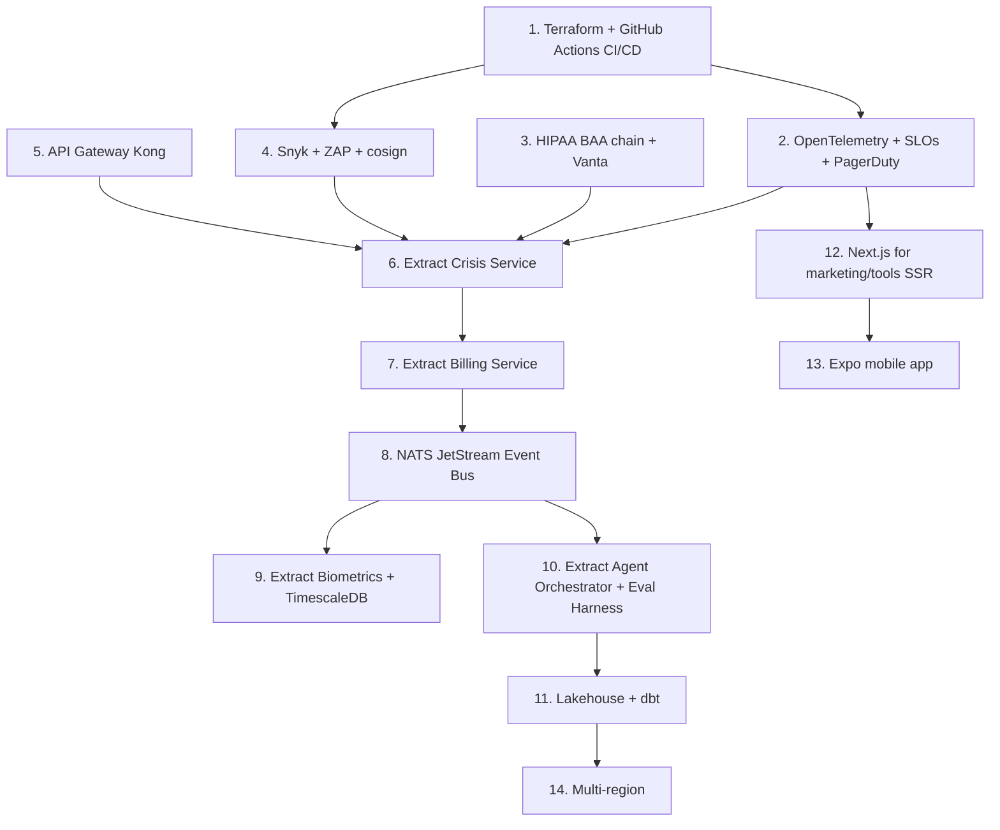

# Platform A → Platform Z Transformation Blueprint
## MyMentalHealthBuddy (MMHB) by The Genuine Love Project

> Strategic 360° architectural assessment, target-state architecture, gap analysis, and execution roadmap.
> Status: **Reference document** — strategic planning only, not auto-executed. Last updated: 2026-04-28.

---

## Executive Summary (TL;DR for the Board)

MMHB today (Platform A) is a **well-organized, safety-first, single-region React/Express monolith on Replit** with strong domain logic (awareness pipeline, agent orchestrator, biometrics, protocols, discernment ladder, Lumi design system) and unusually mature trauma-informed governance (constitutional gate, crisis routing, RBAC, change-gate). It is materially **further along on safety, design, and AI orchestration than most early-stage health-tech platforms**, and materially **earlier on infrastructure, multi-region resilience, formal compliance, observability depth, and platform engineering**.

Platform Z is a **HIPAA-eligible, multi-region, AI-native, zero-trust mental wellness platform** with: (1) modular-monolith → progressive Strangler-Fig extraction of safety-critical domains (crisis, biometrics, billing) into independently scalable services; (2) event-driven backbone for biometrics, awareness, and admin telemetry; (3) Lakehouse + Vector DB for outcome research and personalization; (4) full OpenTelemetry observability with SLOs; (5) Kubernetes-on-managed (or Cloud Run / Fargate) compute with GitOps; (6) a Backstage-style developer portal; (7) MLOps for the agent orchestrator with model-registry-backed evaluation.

**Three highest-impact moves in the next 90 days**: (a) lock formal HIPAA-readiness posture (BAA chain, encryption-in-transit-and-at-rest evidence, audit log immutability), (b) ship OpenTelemetry tracing across the existing 100+ Express routes plus the orchestrator, (c) extract billing + crisis as the first two Strangler-Fig services behind a thin API gateway. None of these require rewriting the existing monolith — they are additive guardrails that unlock the next two years of safe scaling.

[ASSUMPTION: MMHB is currently a single-region Replit deployment; ~5–50k MAU stage; not yet under formal HIPAA Business Associate Agreements but handling sensitive mental-health adjacent data; team size 1–5 engineers; revenue model is freemium with a four-tier subscription via Stripe.]

---

## PHASE 1 — Current State Assessment (Platform A, 360°)

### A. Strategic & Business Alignment

| Dimension | Current State | Notes |
|---|---|---|
| Business model | Freemium SaaS, four-tier subscription via Stripe | Confirmed in `replit.md` |
| Personas | B2C primary (individuals seeking mental wellness); admin (B2E) for content + ops | No B2B / partner channel yet |
| Compliance posture | Educational-only positioning avoids medical-device claims; no HIPAA BAA chain documented; GDPR/CCPA not formally evidenced | [ASSUMPTION] |
| Geographic footprint | Single-region (Replit hosting) | No data sovereignty isolation |
| Innovation velocity | High — heavy additive feature delivery (Lumi DS, awareness pipeline, agent orchestrator, biometrics, protocols, discernment) | Tech-debt risk: 100+ Express routes, ~1,856-line `App.jsx` |
| Mission discipline | Excellent — "/crisis" routing, educational-only voice, constitutional gate enforced server-side | Genuine differentiator |

### B. User Experience & Interface Layer

| Dimension | Current State |
|---|---|
| Frontend pattern | **Monolithic SPA** (React 18 + Vite + Wouter, TypeScript-mixed) |
| Mobile strategy | **PWA only** — versioned service worker; no native app; HealthKit integration via webhook from a companion iOS shell [ASSUMPTION] |
| Desktop | Web-only |
| Design system | **Mature** — Aurora Token System + Lumi v2.0 (sage/amber/stone scales, 10 mascot states, 8 button variants, 9 link types). `glp-pane` primitive. WCAG AA target. |
| Performance baseline | Unmeasured at the team level — no Core Web Vitals dashboard or budget [ASSUMPTION] |
| i18n | **Not implemented** — English-only |
| Accessibility | WCAG AA designed-for; no automated audit in CI |

### C. Application & Business Logic Layer

| Dimension | Current State |
|---|---|
| Architecture | **Modular monolith leaning toward distributed monolith** — Express on a single port, ~100 route modules, additive sibling modules in `server/ai/v2/` |
| DDD maturity | Implicit bounded contexts (awareness, agent, biometrics, protocols, discernment, billing, admin) but no published context map or ubiquitous-language glossary |
| API strategy | REST-only via Express; no OpenAPI spec generation; no GraphQL; WebSocket usage limited to chat [ASSUMPTION] |
| State management | Server-side JWT + sessions; client-side TanStack Query v5 cache; Redis-backed agent working memory with in-process fallback |
| Workflow orchestration | Custom deterministic state machines (`agentState.mjs`, `ProtocolExecutor`); no Temporal / Camunda |
| Code quality gates | Mixed — strong runtime safety (Zod, RBAC, constitutional gate); test coverage uneven; no SonarQube/SAST/DAST in CI [ASSUMPTION] |
| AI orchestration | **Sophisticated** — agent registry, three-tier memory, escalation thresholds per division, constitutional rules, audit log to `agent_decisions` |

### D. Data & Intelligence Layer

| Dimension | Current State |
|---|---|
| OLTP | **Neon PostgreSQL via Drizzle ORM**; rich domain tables (awareness_rules, awareness_detections, agent_decisions, content_scores, biometric_*, protocol_*, discernment_*) |
| OLAP / Warehouse | **None** — no Snowflake/BigQuery/Redshift; analytics computed ad-hoc against OLTP |
| Specialized stores | None — no pgvector, no time-series store for biometrics (despite ideal use case), no search index |
| Data governance | Implicit — no DataHub, no formal lineage; PII redaction in chat layer; AES-256-GCM encryption at rest for biometrics |
| ETL/ELT | None — no Airflow / Dagster / dbt |
| AI/ML infrastructure | Direct OpenAI + Perplexity API calls; **no model registry, no feature store, no evaluation harness, no fine-tuning pipeline** |

### E. Infrastructure & Platform Layer

| Dimension | Current State |
|---|---|
| Cloud strategy | **Replit-hosted single-region** [ASSUMPTION] — vendor lock-in is moderate (the `.mjs` server is portable, but the workflow/preview model is Replit-specific) |
| Compute paradigm | Single Node.js process behind Replit's edge proxy; no containers, no K8s, no serverless functions |
| IaC | **None** — no Terraform / Pulumi / CDK; infrastructure is implicit in Replit config |
| Networking | Replit edge + mTLS preview proxy; CORS allowlisting; no service mesh; no edge compute beyond static assets |
| Storage | Replit Object Storage for media (`DEFAULT_OBJECT_STORAGE_BUCKET_ID`, `PUBLIC_OBJECT_SEARCH_PATHS`); no formal backup/snapshot lifecycle policy beyond Neon's defaults |

### F. Security & Trust Layer

| Dimension | Current State | Strength |
|---|---|---|
| IAM | JWT (`JWT_SECRET`), GitHub OAuth, admin token; **no SSO / SAML / OIDC for end-users**; no MFA [ASSUMPTION] | ★★ |
| Secrets management | Replit Secrets (env vars); no Vault, no rotation policy | ★★ |
| AppSec | Helmet, CSP headers, input sanitization, rate limiting; **no SAST/DAST/SCA in CI** | ★★ |
| Data security | TLS in transit; Neon encryption at rest; **AES-256-GCM application-layer for biometrics** (above industry baseline); no tokenization for PII | ★★★ |
| Runtime protection | CSP, Helmet, change-gate protocol for admin ops; no RASP, no Falco | ★★ |
| Compliance posture | **Educational-only positioning is the primary compliance shield**; no SOC2 / HIPAA / ISO27001 audit; constitutional gate provides excellent ethical safety | ★★★★ on ethics, ★ on formal compliance |
| Crisis routing | **Best-in-class** — unified crisis detection short-circuits all paths; awareness pipeline writes detections to db; constitutional rule #1 is crisis routing | ★★★★★ |

### G. Observability & Operations Layer

| Dimension | Current State |
|---|---|
| Telemetry | Sentry (errors + perf); structured event logging in `agent_decisions` and `awareness_detections`; **no Prometheus/Grafana, no Loki, no Tempo/Jaeger** |
| APM/RUM | Sentry performance only; no real-user monitoring beyond Sentry's defaults |
| Incident management | **None formalized** — no on-call rotation, no PagerDuty, no incident command [ASSUMPTION] |
| Reliability engineering | Health probes + readiness gate + self-healing stack with AI-driven diagnosis (excellent foundation); **no published SLO/SLI/SLA, no error budgets, no chaos engineering** |
| FinOps | Implicit — Replit + Neon + Stripe + OpenAI bills; no tagging, no waste detection, no cost dashboards [ASSUMPTION] |

### H. Integration & Ecosystem Layer

| Dimension | Current State |
|---|---|
| Messaging | **None** — no Kafka / RabbitMQ / SQS; biometrics scheduler polls in-process |
| Integration patterns | Direct REST + webhook (HealthKit, Oura, Google Fit, Whoop); no API gateway, no iPaaS |
| Event architecture | Implicit — agent_decisions is an event log but not a bus; no CDC, no idempotency keys at HTTP layer [ASSUMPTION] |
| Third-party integrations | OpenAI, Perplexity, Stripe, Sentry, Resend, Replit Auth, GitHub OAuth, Oura, Google Fit, Whoop, HealthKit |
| Developer ecosystem | **None** — no public API portal, no sandbox, no docs site beyond `replit.md` |

### I. Engineering Culture & Delivery Layer

| Dimension | Current State |
|---|---|
| SDLC | Implicit Agile (single-developer / small team), no formal Scrum/Kanban tooling [ASSUMPTION] |
| DX | **Excellent for the Replit context** — workflows, preview pane, per-task agent isolation; weak for off-Replit dev (no devcontainer.json, no docker-compose) |
| CI/CD | Replit auto-restart on save; **no GitHub Actions / CircleCI; no DORA metrics; no canary/blue-green releases** [ASSUMPTION] |
| Team topology | Single stream-aligned team [ASSUMPTION]; the platform-team and complicated-subsystem-team layers don't yet exist |
| Knowledge management | **Strong** — `replit.md` is genuinely load-bearing documentation; ADRs are not formalized but the constitutional gate doc + change-gate protocol approximate them |

### Current-State System Context (C4 Level 1)

---

## PHASE 2 — Target State (Platform Z)

### Target System Context (C4 Level 1)

### Per-Domain Target State

#### A. Strategic & Business
- **Compliance posture**: HIPAA-eligible (BAA chain with Neon, OpenAI, Stripe, Resend); SOC2 Type II within 24 months; GDPR + CCPA evidence pack; ISO 27001 optional, only if enterprise B2B becomes a revenue line.
- **Personas**: add B2B (clinics, EAPs, schools) and Partner (wearable + EHR partners).
- **Geo**: dual-region active-active in US (us-east + us-west) by Phase 4; EU region by Phase 5 if EU revenue justifies.
- **Patterns**: portfolio governance via lightweight ADRs in `/docs/adr/`; OKR cadence; quarterly architecture review.

#### B. UX & Interface
- **Frontend**: migrate to **Next.js 15 (App Router)** for SSR/SSG of marketing + tools pages (SEO + Core Web Vitals win), keeping the authenticated app as a React island. Wouter → Next router for marketing only; keep Wouter inside the gated app.
- **Micro-frontends**: introduce **Module Federation (Webpack 5 / Vite Federation)** only when a second team owns a vertical (e.g., Discernment, Biometrics). Not before.
- **Mobile**: native iOS + Android via **Expo + React Native** sharing the design system tokens; HealthKit and HealthConnect first-class.
- **Design system**: extract `lumi-*` to a versioned package `@tglp/lumi` (npm or internal registry); add Storybook + visual regression (Chromatic or Lost Pixel).
- **Performance**: Core Web Vitals budget enforced in CI (Lighthouse-CI); LCP < 2.5s p75, INP < 200ms p75, CLS < 0.1 p75.
- **i18n**: `next-intl` or `react-i18next`; start with EN/ES given US Hispanic mental-health gap.
- **A11y**: `axe-core` + `pa11y-ci` in CI; manual audit per release; aim WCAG 2.2 AA enforced, AAA for crisis flows.

#### C. Application & Business Logic
- **Architecture pattern**: **Modular Monolith → Strangler Fig**. Extract in this order: (1) Crisis Service (highest stakes, smallest surface), (2) Billing Service (revenue isolation), (3) Biometrics Service (heaviest write load), (4) Agent Orchestrator Service (independent scaling for LLM costs). Keep awareness, discernment, protocols, content in the core monolith for years — they have low coupling and high cohesion.
- **DDD**: publish a context map; each bounded context gets a `CONTEXT.md` with ubiquitous language and aggregates.
- **API strategy**: **OpenAPI 3.1 spec generated from Zod schemas** (e.g., `@asteasolutions/zod-to-openapi`); GraphQL Federation only at the BFF tier and only if mobile + web diverge significantly. WebSocket → migrate chat to **Server-Sent Events** or stay on WS but behind the gateway.
- **State management**: keep TanStack Query; introduce **Zustand** for cross-cutting client state if it grows; server-side stays JWT + Redis sessions; Redis becomes the official second store (no more in-process fallback in production).
- **Workflow orchestration**: introduce **Temporal** for: protocol session lifecycles (long-running, retryable), biometrics ingestion retries, billing webhook reconciliation, GDPR deletion requests. Keep `ProtocolExecutor` semantics, run them as Temporal activities.
- **Code quality**: SonarQube or CodeQL in CI; test coverage gates: 80% unit, 60% integration, 100% on crisis + billing modules; mutation testing (Stryker) on safety-critical code.
- **Patterns**: Circuit Breaker (e.g., Opossum) on every external API; Saga pattern for billing + entitlement; CQRS for the analytics read model only.

#### D. Data & Intelligence
- **OLTP**: **Postgres 16 with read replicas** (Neon's branching is a great feature — keep it, but add a replica for analytics queries to stop competing with OLTP).
- **OLAP**: **Lakehouse** = S3 + Delta Lake + DuckDB / ClickHouse for serving. Pipeline via CDC (Debezium → Kafka → Delta) or simpler: nightly `pg_dump_to_parquet` if volume is small.
- **Specialized stores**:
  - **pgvector** in the existing Postgres for awareness rule embeddings + RAG over the wellness library (cheapest path).
  - **TimescaleDB** (Postgres extension) for biometric time-series — drop-in, keeps Drizzle compatibility.
  - **OpenSearch** only when the wellness library exceeds ~10k entries.
- **Data governance**: **OpenMetadata** (open source) for catalog + lineage; Great Expectations for data quality on biometrics + outcome measures; PII tagging at the schema level.
- **ETL/ELT**: **Dagster** (Python) for batch; Kafka Connect / Debezium for CDC; **dbt** for transformation in the warehouse.
- **AI/ML infra**:
  - **Model registry**: Weights & Biases or MLflow for prompt versions + eval scores.
  - **Eval harness**: golden dataset of 200+ chat turns × constitutional rules, run on every prompt change; gate deploy on regression.
  - **RAG**: pgvector + a thin retrieval layer over the wellness library + the user's own consented journal entries.
  - **Fine-tuning**: deferred — start with prompt-engineering and structured output; revisit when LLM costs > $5k/mo.
  - **Feature store**: Feast only when biometrics-driven personalization ships.

#### E. Infrastructure & Platform
- **Cloud**: pick one — **AWS** (recommended for HIPAA BAA breadth + Stripe Atlas familiarity) or **GCP** (better DX, lower lock-in). Avoid multi-cloud until Phase 5.
- **Compute**: **AWS Fargate + ECS** (or GCP Cloud Run) for stateless services — gets you 80% of K8s benefits without the ops cost. Move to **EKS / GKE** only when you have a platform team. Replit stays for prototyping + non-prod.
- **IaC**: **Terraform + Terragrunt** for cloud; **Pulumi** is fine if the team prefers TypeScript end-to-end.
- **GitOps**: ArgoCD if you go K8s; CodeDeploy / Cloud Deploy if you stay on Fargate / Cloud Run.
- **Networking**: **Cloudflare** at the edge (WAF + CDN + Workers for redirects + DDoS); **AWS PrivateLink / VPC peering** to Neon; Service mesh (Linkerd, lighter than Istio) only at >5 services.
- **Storage**: S3 for objects (with lifecycle to Glacier after 90 days for cold logs); EBS gp3 for any block needs; Litestream as a backup tier for SQLite caches if introduced.

#### F. Security & Trust
- **IAM**: end-user **WorkOS** or **Auth0** (drop-in OIDC, supports SSO upgrade for B2B); admin SSO via Google Workspace or Okta; **MFA mandatory for admin**; just-in-time access via AWS IAM Identity Center.
- **Secrets**: **AWS Secrets Manager** with 90-day rotation policy; sops-encrypted secrets in git for non-sensitive env config.
- **AppSec**: **Snyk** or **Dependabot + GitHub Advanced Security** (SCA + SAST); **OWASP ZAP** in nightly CI for DAST; **Sigstore + cosign** for image signing.
- **Data security**: continue AES-256-GCM at app layer for biometrics; add **AWS KMS** envelope encryption; tokenize PII columns; **field-level encryption** for journal entries with user-derived keys.
- **Runtime**: **Falco** for K8s when you get there; **AWS GuardDuty** + **CloudTrail**; **CSP report-only → enforce** rollout.
- **Compliance**: **Vanta** or **Drata** for evidence collection (SOC2 + HIPAA); policy-as-code via **Open Policy Agent** for admin endpoints; immutable audit log via append-only S3 bucket with object lock.

#### G. Observability & Operations
- **Telemetry**: **OpenTelemetry SDK** in the Express server + agent orchestrator; export to **Grafana Cloud** (Tempo + Loki + Mimir) or self-host on the same K8s cluster.
- **APM/RUM**: keep Sentry for errors; add **Grafana Faro** or **Datadog RUM** for real-user metrics tied to Core Web Vitals.
- **Incident management**: **PagerDuty** + a single on-call rotation initially; runbooks in `docs/runbooks/`; blameless post-mortems.
- **Reliability**: define SLOs — Crisis route: 99.99% availability + p99 < 500ms; Chat: 99.9% + p99 < 3s; Tools: 99.9% + p99 < 1s. Error budgets enforced. **Chaos**: Litmus or AWS FIS quarterly game days, never against the crisis path in prod.
- **FinOps**: **Vantage** or **CloudHealth**; tag every resource with `env`, `service`, `owner`, `cost-center`; weekly cost review; OpenAI cost dashboard with per-user-tier attribution.

#### H. Integration & Ecosystem
- **Messaging**: **Kafka (MSK)** or **NATS JetStream** (lighter, Go-native, easier on a small team — recommended default). Topics: `biometric.reading`, `awareness.detection`, `agent.decision`, `billing.event`, `crisis.escalation`.
- **Integration**: **Kong** or **Apigee** as API gateway (Kong is open-source-friendlier); **n8n** or **Temporal** for internal workflow automation; no enterprise iPaaS unless B2B integrations explode.
- **Event architecture**: idempotency keys on every webhook; outbox pattern for events that must follow DB writes; CDC via Debezium for the Lakehouse.
- **Third-party**: same set, plus **Twilio** (SMS for crisis follow-up consented users), **Segment** (CDP for marketing analytics, opt-in only).
- **Partner ecosystem**: public OpenAPI portal (Stoplight / ReadMe) when first B2B partner signs.

#### I. Engineering Culture & Delivery
- **SDLC**: Linear / Jira for tickets; trunk-based development with feature flags (LaunchDarkly or open-source Unleash).
- **DX**: `devcontainer.json` + `docker-compose.dev.yml` for off-Replit parity; **Backstage** for service catalog when service count > 5.
- **CI/CD**: GitHub Actions; standard pipeline = lint → typecheck → unit → integration → build → SBOM → sign → deploy-staging → smoke → progressive deploy to prod (10% → 50% → 100% with auto-rollback on SLO breach).
- **DORA**: dashboard tracking deployment frequency (target: daily), lead time (target: <1 day), MTTR (target: <1 hour), change failure rate (target: <15%).
- **Team topology**: stream-aligned (one per domain), enabled by a **platform team** of 1–2 once headcount ≥ 8; complicated-subsystem team for the agent orchestrator + safety once it has 2 dedicated FTE.
- **Knowledge**: ADRs in `docs/adr/NNNN-title.md`; runbooks in `docs/runbooks/`; `replit.md` becomes the index; auto-generated API docs from OpenAPI.

### Container Diagram (C4 Level 2) — Target

### Deployment Topology — Target

---

## PHASE 3 — Gap Analysis & Transformation Strategy

### Critical Gaps (Current vs. Target)

| Domain | Critical Gap | Severity | Migration Pattern |
|---|---|---|---|
| A. Strategy | No formal HIPAA / SOC2 evidence | HIGH | Vanta + BAA chain; 6 months |
| B. UX | No SSR/SSG; SEO + LCP suboptimal | MED | Strangler Fig: marketing pages → Next.js first, keep gated app on Vite |
| B. UX | No native mobile | MED | Greenfield Expo app sharing `@tglp/lumi` |
| B. UX | No i18n | LOW | next-intl when EU/LATAM revenue justifies |
| C. App | Distributed monolith risk | MED | Strangler Fig: Crisis → Billing → Biometrics → Agent |
| C. App | No OpenAPI spec | MED | Generate from Zod; ship in CI |
| C. App | No model evaluation harness | HIGH | Build golden-set eval; gate prompt deploys |
| D. Data | No warehouse / lakehouse | MED | Phase 2: nightly Postgres → Parquet → DuckDB |
| D. Data | No vector store for RAG | MED | pgvector in existing Postgres |
| D. Data | No time-series store for biometrics | MED | TimescaleDB extension |
| E. Infra | Single region, no IaC | HIGH | Terraform from day 1; multi-region in Phase 4 |
| E. Infra | Implicit Replit lock-in | MED | Containerize first, then portability is mostly free |
| F. Security | No SAST/DAST in CI | HIGH | Snyk + ZAP in GitHub Actions |
| F. Security | No formal compliance audit | HIGH | Vanta + SOC2 Type II by month 18 |
| F. Security | No MFA / SSO for admin | HIGH | WorkOS or Okta; 2 weeks |
| G. Obs | No distributed tracing | HIGH | OpenTelemetry SDK + Grafana Tempo; 4 weeks |
| G. Obs | No SLOs / error budgets | HIGH | Define + enforce in 30 days |
| G. Obs | No on-call / incident process | HIGH | PagerDuty + runbooks; 30 days |
| H. Integration | No event bus | MED | NATS JetStream; introduce when biometrics or admin telemetry hits scale |
| H. Integration | No API gateway | MED | Kong or AWS API Gateway when first service is extracted |
| I. Culture | No CI/CD pipeline | HIGH | GitHub Actions with progressive delivery; 30 days |
| I. Culture | No DORA dashboard | MED | LinearB or hand-rolled; 60 days |
| I. Culture | No ADRs | LOW | `docs/adr/` template; ongoing |

### Risk Matrix

| Risk | Category | Probability | Impact | Mitigation |
|---|---|---|---|---|
| Crisis-routing regression during Strangler-Fig extraction | Technical | MED | CRITICAL | Extract Crisis Service first, behind feature flag, with shadow-traffic comparison for 30 days before cutover |
| HIPAA exposure if a partner discloses MMHB handles PHI before BAA chain is in place | Compliance | MED | HIGH | Move HIPAA evidence work to Phase 1; until then, strict "educational only" positioning enforced in all marketing copy |
| LLM cost runaway during agent orchestrator scale-up | Financial | HIGH | MED | Per-tier rate limits + per-user monthly LLM-token budget enforced in agent orchestrator; daily cost dashboard with auto-alert |
| Single-developer bus factor | Organizational | HIGH | CRITICAL | Document load-bearing modules in `docs/adr/`; cross-train on agent orchestrator + crisis safety; consider a contracted on-call partner |
| Replit dependency limits multi-region scaling | Technical | HIGH | MED | Containerize early (Phase 1) so cloud migration is mechanical, not architectural |
| Drizzle / Neon migration during cloud move | Technical | LOW | MED | Neon's branching makes blue/green DB migration tractable; rehearse twice in staging |
| AI safety incident (constitutional gate bypass) | Reputational | LOW | CRITICAL | Quarterly red-team exercise on the agent orchestrator; expand constitutional rules; eval harness must catch jailbreaks |
| User-data breach via biometric provider OAuth | Security | LOW | HIGH | Token rotation; least-privilege scopes; quarterly access review; AES-256-GCM is already in place — preserve it |
| Founder fatigue from compliance work | Organizational | HIGH | MED | Use Vanta to automate 70% of evidence; outsource pen-test + audit; budget the work in $ not hours |

### Dependency Map (Sequencing)

---

## PHASE 4 — Execution Roadmap

### Phase 1: FOUNDATION (Months 0–6)

**Objective**: Pave a stable, observable, secure road without rewriting the monolith.

| OKR | Target |
|---|---|
| OKR 1.1 | 100% of services emitting OpenTelemetry traces |
| OKR 1.2 | SLOs published + dashboards live for crisis, chat, tools |
| OKR 1.3 | CI/CD pipeline with progressive deploy + auto-rollback |
| OKR 1.4 | Vanta onboarded; HIPAA gap-assessment complete |
| OKR 1.5 | Terraform + GitHub Actions managing 100% of net-new infra |

**Deliverables**: OTel SDK wired, Grafana dashboards, PagerDuty rotation, Snyk + cosign in CI, Terraform baseline, Vanta evidence collection running, MFA on all admin accounts, devcontainer.json shipped.

**Resources**: 1 platform engineer (contract or hire), 1 security advisor (fractional), Vanta + Grafana Cloud subscriptions (~$1.5k/mo combined).

**Quick wins (first 30 days)**: PagerDuty on the Sentry alerts you already have; Snyk free tier scanning the repo; SLO doc in `docs/slos.md`; admin MFA via WorkOS free tier.

**Go/No-Go gate**: at end of month 6, all four extraction-target services (crisis, billing, biometrics, agent) must have OTel traces + SLO dashboards before Phase 2 begins.

### Phase 2: UNIFICATION (Months 6–12)

**Objective**: Add the connective tissue that makes service extraction safe.

| OKR | Target |
|---|---|
| OKR 2.1 | API Gateway live in front of monolith with 100% traffic |
| OKR 2.2 | Crisis Service extracted with 30-day shadow-traffic parity |
| OKR 2.3 | Billing Service extracted; Stripe webhooks idempotent |
| OKR 2.4 | NATS JetStream live for biometric.reading + awareness.detection |
| OKR 2.5 | Marketing + tools pages on Next.js with Core Web Vitals in budget |
| OKR 2.6 | Eval harness with 200-turn golden set gating prompt deploys |

**Deliverables**: Kong gateway, Crisis Service v1, Billing Service v1, NATS cluster, Next.js marketing site, OpenAPI spec auto-generated from Zod, eval harness in CI.

**Resources**: +1 backend engineer, +1 frontend engineer; Kong Konnect or self-hosted; NATS JetStream on Fargate.

**Quick wins**: OpenAPI spec ships in week 1 (purely additive, big DX win); Lighthouse-CI on PRs.

**Go/No-Go gate**: Crisis Service must run 30 days at 100% traffic with zero parity diffs vs. monolith before extracting billing.

### Phase 3: MODERNIZATION (Months 12–18)

**Objective**: Decompose the heaviest domains; light up AI/ML platform; ship mobile.

| OKR | Target |
|---|---|
| OKR 3.1 | Biometrics Service extracted onto TimescaleDB |
| OKR 3.2 | Agent Orchestrator Service extracted with MLflow registry |
| OKR 3.3 | Lakehouse online; first three product analytics dashboards in DuckDB |
| OKR 3.4 | Native iOS + Android in app stores (Expo) |
| OKR 3.5 | SOC2 Type I report issued; HIPAA BAA chain complete |

**Deliverables**: Biometrics Service, Agent Orchestrator Service, MLflow + W&B, Lakehouse + dbt, Expo apps, SOC2 Type I.

**Resources**: +1 mobile engineer, +1 data engineer, fractional MLOps; SOC2 auditor.

**Quick wins**: pgvector RAG over the wellness library — works without any infra change.

**Go/No-Go gate**: SOC2 Type I before any B2B (clinic / EAP / school) contract is signed.

### Phase 4: OPTIMIZATION (Months 18–24)

**Objective**: Multi-region resilience, FinOps discipline, chaos-tested reliability.

| OKR | Target |
|---|---|
| OKR 4.1 | us-east + us-west active-active with RTO < 5min, RPO < 1min |
| OKR 4.2 | FinOps: cost-per-MAU declining quarter-over-quarter |
| OKR 4.3 | Quarterly chaos game days run; zero customer-visible incidents from them |
| OKR 4.4 | DORA: daily deploys, <1h MTTR, <10% CFR |
| OKR 4.5 | SOC2 Type II report issued |

**Deliverables**: Multi-region terraform, Vantage cost dashboards, Litmus chaos suite, DORA dashboard, SOC2 Type II.

**Resources**: +1 SRE, +1 finance ops contractor.

**Quick wins**: tag everything for cost; one game day in non-prod within 30 days.

**Go/No-Go gate**: cost-per-MAU must trend down for two consecutive quarters before Phase 5 spend.

### Phase 5: INNOVATION (Months 24+)

**Objective**: AIOps, predictive personalization, new market expansion.

| OKR | Target |
|---|---|
| OKR 5.1 | Predictive crisis-risk scoring (consented users only) |
| OKR 5.2 | Auto-tuned response policies based on outcome measures |
| OKR 5.3 | EU region launched if EU MAU > 10% |
| OKR 5.4 | Public partner API for licensed clinicians |
| OKR 5.5 | Carbon-aware scheduling for batch jobs |

**Deliverables**: Risk scoring service (with strict consent + clinician override), partner portal (Stoplight), EU region, AIOps with self-remediation playbooks.

**Resources**: +1 ML scientist, +1 partnerships engineer, +1 EU privacy counsel (fractional).

**Go/No-Go gate**: any predictive scoring must pass an external ethics review and pilot with clinical partners — never auto-route on a model alone.

---

## First 90 Days — Tactical Action Plan

| Week | Action | Owner | Outcome |
|---|---|---|---|
| 1 | Inventory all 100+ Express routes; tag by domain (crisis, billing, biometrics, agent, awareness, content, admin, etc.) | Tech lead | `docs/route-inventory.md` |
| 1 | Stand up `docs/adr/` with ADR-0001: "Modular monolith → Strangler Fig" | Tech lead | First ADR merged |
| 2 | Wire OpenTelemetry SDK into `server/app.mjs`; export to Grafana Cloud free tier | Platform | Traces visible for 100% of requests |
| 2 | PagerDuty free trial; route Sentry + uptime alerts to a single rotation | Platform | First synthetic page received |
| 3 | Define SLOs in `docs/slos.md` for crisis, chat, tools; publish error budgets | Tech lead | SLO doc reviewed + approved |
| 3 | Enable MFA on all admin accounts; rotate `ADMIN_TOKEN` and `JWT_SECRET` | Security | MFA evidence captured |
| 4 | Snyk free scan in GitHub Actions on every PR | Platform | First PR blocked on a CVE |
| 4 | `devcontainer.json` + `docker-compose.dev.yml` for off-Replit parity | Platform | One engineer runs the app off-Replit |
| 5 | Vanta onboarding kickoff; HIPAA gap-assessment scoping | Security | Vanta dashboard live |
| 5 | Generate OpenAPI 3.1 spec from Zod schemas; publish at `/api/openapi.json` | Backend | Spec validates against linter |
| 6 | Lighthouse-CI on PRs; budget LCP < 2.5s, INP < 200ms, CLS < 0.1 | Frontend | First PR blocked on perf regression |
| 6 | Define golden-set of 200 chat turns; first run of constitutional-rule evals | AI lead | Eval baseline recorded |
| 7 | Terraform baseline: state backend (S3 + DynamoDB lock), one IAM module | Platform | `terraform plan` clean |
| 7 | First runbook: "PagerDuty page → triage → who-to-page-next" | Platform | Runbook reviewed in mock incident |
| 8 | Pick API gateway (Kong vs. AWS API Gateway); spike the chosen one in staging | Platform | Decision ADR merged |
| 8 | Cost dashboard: Replit + Neon + OpenAI + Stripe + Sentry monthly burn | Finance | First $ number on a wall |
| 9 | Crisis Service extraction kickoff: scope, contract test, shadow-traffic plan | Backend + Tech lead | Extraction plan ADR merged |
| 9 | Mock chaos game day in staging: kill the agent orchestrator, watch SLOs | Platform | Postmortem doc written |
| 10 | Begin SOC2 Type I evidence collection in Vanta (controls 1–20 of ~80) | Security | 25% evidence complete |
| 10 | Eval harness wired into CI; prompts gated on no-regression | AI lead | First prompt PR auto-blocked |
| 11 | First Crisis Service prototype running locally; contract tests green | Backend | Contract suite published |
| 11 | DORA dashboard MVP (just deploy frequency + lead time) | Platform | First weekly DORA review |
| 12 | Crisis Service deployed to staging behind feature flag; 0% traffic | Backend | Deployment validated |
| 12 | Quarterly architecture review #1 — close out Phase-1 OKR baseline | Tech lead | Phase 2 plan approved |
| 13 | Crisis Service shadow-traffic at 5% in production; parity dashboard live | Backend + Platform | Parity diff < 0.1% |

---

## Decisive Recommendations (Opinionated Defaults)

These are the choices I recommend you make without further debate, and the reasons:

1. **Stay on the modular monolith for awareness, discernment, protocols, content.** They have low coupling and benefit from co-location. Resist the urge to microservice them.
2. **Extract crisis first.** It's the highest-stakes path with the smallest surface area. Practice the extraction discipline on it before touching billing.
3. **Pick AWS, not multi-cloud.** HIPAA BAA breadth + Stripe Atlas + Replit-to-AWS migration tooling is unmatched. Multi-cloud costs you a year of platform work with no proportional benefit at your scale.
4. **Pick Postgres for everything you can.** TimescaleDB and pgvector are extensions — you don't need a new database, you need new schemas. Defer Snowflake/Pinecone until your data scientist asks for them by name.
5. **Pick NATS JetStream over Kafka.** Kafka is overkill for your event volume in the next 24 months. NATS is operationally lighter and easier on a small team.
6. **Pick Cloudflare at the edge.** WAF + CDN + DDoS for ~$200/mo with no infra to run. Workers can replace small Lambda needs later.
7. **Pick Vanta over building compliance in-house.** SOC2 Type II evidence collection is a solved problem; pay for the solution.
8. **Pick PagerDuty over building on-call in-house.** Same logic — solved problem.
9. **Pick LaunchDarkly or Unleash for feature flags.** You already need flags for the Crisis Service shadow rollout.
10. **Defer micro-frontends, GraphQL Federation, and Kubernetes** until headcount + service count justify them. None of them earn their cost at <8 engineers and <5 services.

---

## Open Items / Decisions Required from Leadership

Before Phase 1 starts, the founder/leadership must decide:

1. **HIPAA scope**: Are we declaring the platform HIPAA-eligible (which mandates BAA chain + audit) or staying strictly educational-only (which mandates ironclad marketing-copy discipline)? This decision gates almost everything in compliance.
2. **Cloud target**: AWS vs. GCP. Recommendation: AWS.
3. **Hiring vs. contracting** for the platform engineer role. Recommendation: contract for first 6 months, then hire if extraction velocity warrants.
4. **Budget envelope** for Phase 1 tooling (Vanta, Grafana, PagerDuty, Snyk, Cloudflare, Terraform Cloud) ≈ $2.5k–4k/month all-in.
5. **B2B timeline**: Is there a clinic/EAP/school pipeline to anchor the SOC2 Type I urgency? If yes, accelerate. If not, defer SOC2 Type I to month 18.

---

## Closing Note

MMHB has rare assets: a load-bearing safety culture, a maturing design system, a thoughtful agent architecture with a constitutional gate, and documentation discipline (`replit.md`) that most teams never achieve. The transformation to Platform Z is not a rewrite — it is a **disciplined, additive layering of platform engineering, formal compliance, and progressive service extraction** over a foundation that is already healthier than its size suggests.

The right next step is not architecture. It is **measurement + safety nets**: OpenTelemetry traces, SLOs, on-call, MFA, and CI security gates. Build those in the first 60 days, then everything that follows is execution against a clear scoreboard.

— End of blueprint.
